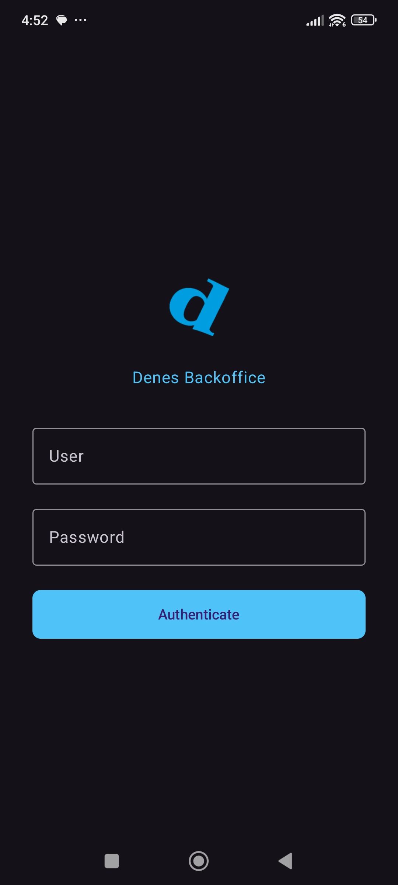
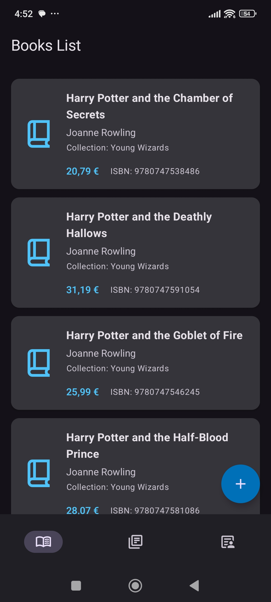
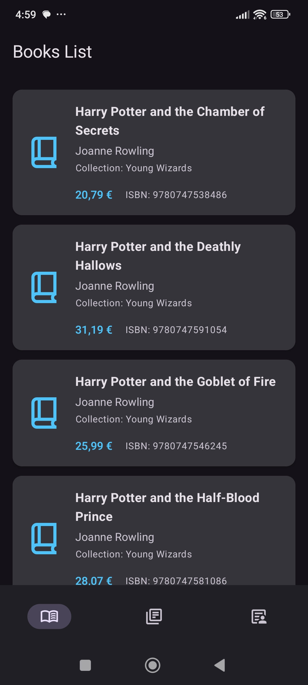
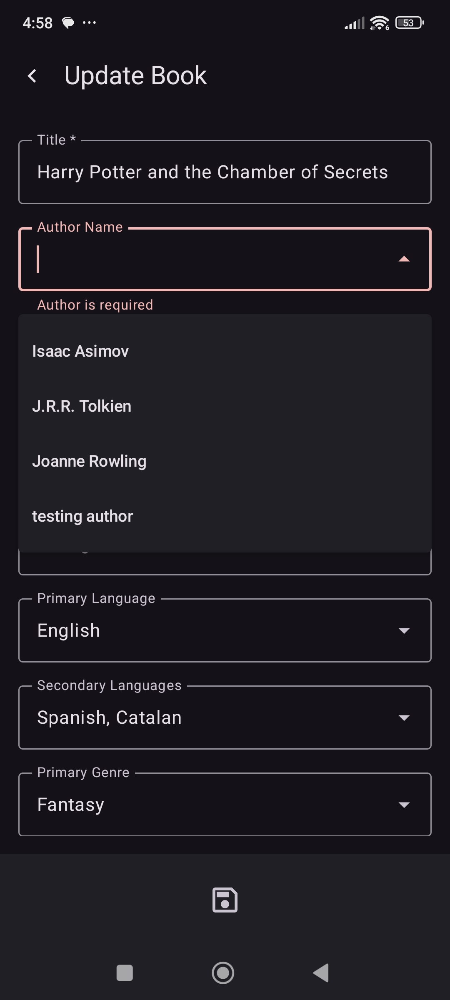
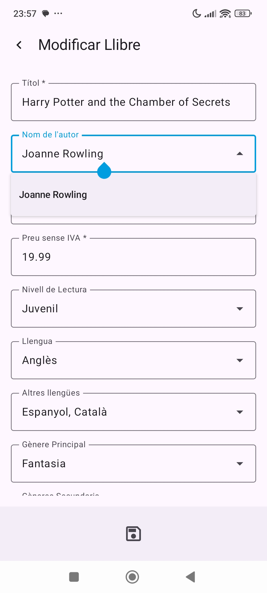
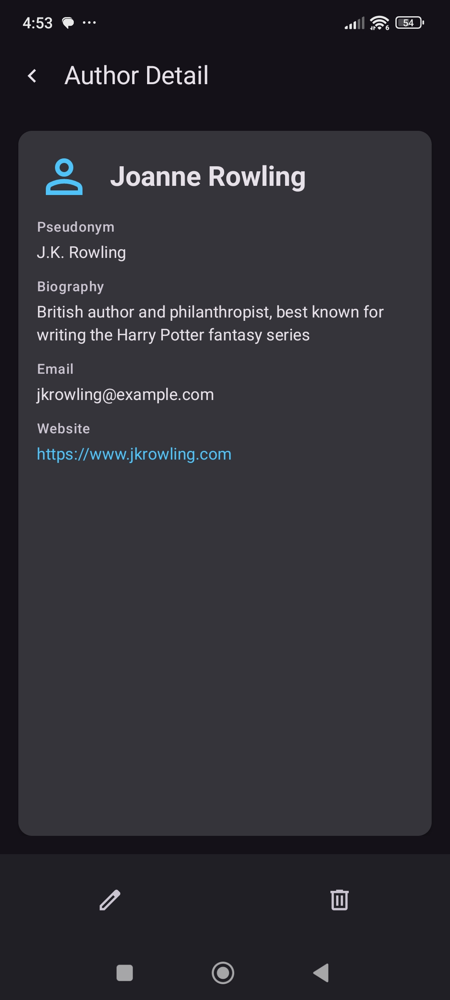
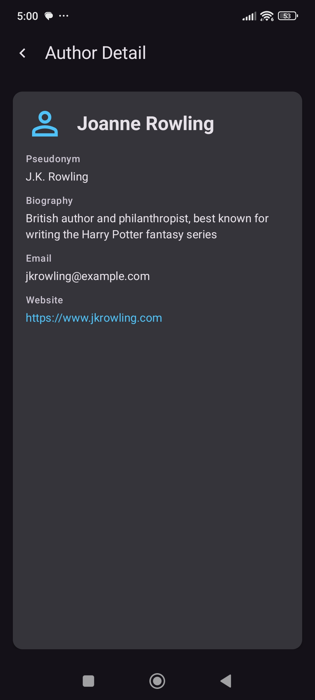
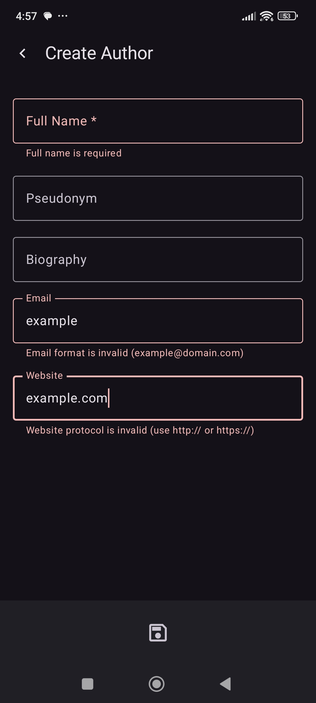
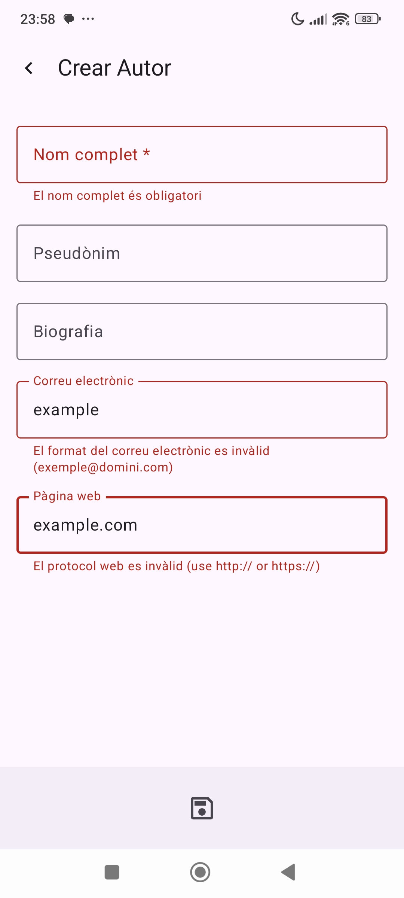
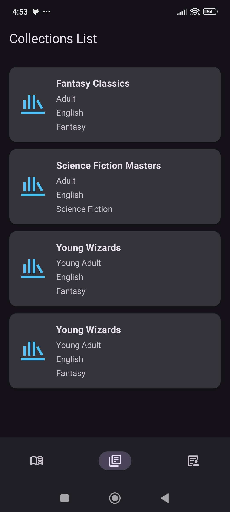

# Book Publishing Backend

[](https://github.com/CescFe/book-publishing-app/releases/latest)
[](https://github.com/CescFe/book-publishing-app/blob/main/LICENSE)

Frontend client for the Book Publishing platform. Native Android application which consumes the [book-publishing-backend](https://github.com/CescFe/book-publishing-backend) RESTful API to manage books, authors, and collections.

---

## 📑 Table of Contents

- [📌 About the Project](#-about-the-project)
    - [🔎 Tech Stack](#-tech-stack)
    - [🏗️ Architecture](#-architecture)
    - [🧱 Structure](#-structure)
- [🔐 Authentication & Authorization](#-authentication--authorization)
- [📱 Screens](#-screens)
- [🌍 Internationalization](#-internationalization)
- [🎨 Theme & Appearance](#-theme--appearance)
- [🔧 Build Configuration](#-build-configuration)
- [🧪 Testing Strategy](#-testing-strategy)
- [⚙️ CI/CD Workflow](#-cicd-workflow)
- [Code Quality](#code-quality)
- [🔌 API Integration](#-api-integration)
- [License](#license)

---

## 📌 About the Project

### 🔎 Tech Stack

| Technology                | Purpose                               |
|---------------------------|---------------------------------------|
| **Kotlin 2.0**            | Programming language                  |
| **Jetpack Compose**       | Modern declarative UI toolkit         |
| **Material Design 3**     | Design system with brand theming      |
| **Retrofit + OkHttp**     | HTTP client for API communication     |
| **Kotlin Coroutines**     | Asynchronous operations in ViewModels |
| **Jetpack Navigation**    | Navigation between screens            |
| **ViewModel + StateFlow** | UI state management                   |
| **Gradle + Spotless**     | Build system and code formatting      |

### 🏗️ Architecture

This project follows **Clean Architecture** with **MVVM** pattern:

- **Presentation Layer**: Composables, ViewModels, UI state management
- **Domain Layer**: Use cases, business logic, repository interfaces
- **Data Layer**: API services, repositories, data sources

### 🧱 Structure
```
app/src/main/java/org/cescfe/book_publishing_app/
├── ui/
│ ├── theme/ # Design system & theming
│ ├── navigation/ # Navigation graphs
│ ├── shared/ # Shared components
│ ├── auth/ # Authentication flow
│ ├── authors/ # Author management
│ ├── books/ # Book management
│ └── collections/ # Collection management
├── domain/
│ ├── repository/ # Repository interfaces
│ ├── model/ # Domain models
│ └── usecase/ # Business use cases
└── data/
├── remote/ # API services & DTOs
└── repository/ # Repository implementations
```

## 🔐 Authentication & Authorization

Authentication is handled via JWT tokens and the app implements **role-based authentication** with the following user roles:

### Admin User
- **Full Access**: Read, write, and delete permissions
- Can perform all CRUD operations on books and authors

### Base User (Read-Only)
- **Limited Access**: Read-only permissions
- Can only view books (list and detail), authors (list and detail), and collections (list)
- Cannot create, update, or delete any resources

## 📱 Screens

### Login



### Books List (admin vs read only)

<table>
<tr>
<td></td>
<td></td>
</tr>
<tr>
<td style="text-align: center;"><strong>Admin View</strong></td>
<td style="text-align: center;"><strong>Read-Only View</strong></td>
</tr>
</table>

### Book Update (english dark theme vs catalan light theme)

<table>
<tr>
<td></td>
<td></td>
</tr>
<tr>
<td style="text-align: center;"><strong>Admin View</strong></td>
<td style="text-align: center;"><strong>Read-Only View</strong></td>
</tr>
</table>

### Author Detail (admin vs read only)

<table>
<tr>
<td></td>
<td></td>
</tr>
<tr>
<td style="text-align: center;"><strong>Admin View</strong></td>
<td style="text-align: center;"><strong>Read-Only View</strong></td>
</tr>
</table>

### Author Create (english dark theme vs catalan light theme)

<table>
<tr>
<td></td>
<td></td>
</tr>
<tr>
<td style="text-align: center;"><strong>Admin View</strong></td>
<td style="text-align: center;"><strong>Read-Only View</strong></td>
</tr>
</table>

### Collections List



## 🌍 Internationalization

The app is developed natively in English. In addition, the app dynamically adapts to the device language, supporting Catalan and Spanish.

## 🎨 Theme & Appearance

The app supports **dynamic theme switching** based on the device's system configuration:

- **Light Mode**: Automatically applied when the device is set to light theme
- **Dark Mode**: Automatically applied when the device is set to dark theme
- **Brand Colors**: Custom Editorial Denes color scheme with blue and green accents
- **Material Design 3**: Uses Material 3 color schemes for consistent theming
- **Material Symbol & Icons**: Applies `Google Fonts` Symbol & Icons to adopt android standards
- **Enabled actions based on user roles**:  The app automatically checks user permissions and adjusts the UI accordingly, enabling only the actions that the user have permission to perform.

## 🔧 Build Configuration

The project supports two build types with different configurations:

### Debug Build
- **Configuration File**: `app/dev.properties`
- **Purpose**: Development environment
- **Base URL**: Configured in `dev.properties` file
- **Features**: Full logging, debugging enabled

### Release Build
- **Configuration File**: `app/pro.properties`
- **Purpose**: Production environment
- **Base URL**: Configured in `pro.properties` file
- **Features**: ProGuard rules configured (minification disabled by default)

**Setup Instructions**:
1. Create `app/dev.properties` with `base.url` property for debug builds
2. Create `app/pro.properties` with `base.url` property for release builds
3. These files are excluded from version control (see `.gitignore`)

# Build debug APK
./gradlew assembleDebug

# Build release APK
./gradlew assembleRelease

## 🧪 Testing Strategy

- **Unit Tests**: ViewModels, DTOs, Repository logic
- **Instrumented Tests**: UI components with Compose Testing

```bash
# Run unit tests
./gradlew test

# Run instrumented tests (requires emulator/device)
./gradlew connectedAndroidTest
```

## ⚙️ CI/CD Workflow

### Automatic Validation

Every push to `main` and every **pull request in ready for review** automatically runs:
- ✅ **Spotless Check** — Code formatting validation
- ✅ **Android Lint** — Static code analysis
- ✅ **Unit Tests** — ViewModel and repository tests
- ✅ **Build** — Full project compilation

### Create Tag and Release

1. Go to **Actions** → **Create Release Tag**
2. Run manually with the desired version (e.g., `v1.0`)
3. This creates a Git tag
4. Go to **Tags** → Click on **Release**

## Code Quality

```bash
# Check all formatting
./gradlew spotlessCheck

# Apply formatting
./gradlew spotlessApply

# Run all quality checks
./gradlew check
```

## 🔌 API Integration

The app consumes the [book-publishing-backend](https://github.com/CescFe/book-publishing-backend) RESTful API.

### Authentication

| Endpoint                  | Method | Description         |
|---------------------------|--------|---------------------|
| `POST /api/v1/auth/login` | POST   | User authentication |

### Authors (Full CRUD)

| Endpoint                      | Method | Description       |
|-------------------------------|--------|-------------------|
| `GET /api/v1/authors`         | GET    | List all authors  |
| `GET /api/v1/authors/{id}`    | GET    | Get author by ID  |
| `POST /api/v1/authors`        | POST   | Create new author |
| `PUT /api/v1/authors/{id}`    | PUT    | Update author     |
| `DELETE /api/v1/authors/{id}` | DELETE | Delete author     |

### Books (Full CRUD)

| Endpoint                    | Method | Description     |
|-----------------------------|--------|-----------------|
| `GET /api/v1/books`         | GET    | List all books  |
| `GET /api/v1/books/{id}`    | GET    | Get book by ID  |
| `POST /api/v1/books`        | POST   | Create new book |
| `PUT /api/v1/books/{id}`    | PUT    | Update book     |
| `DELETE /api/v1/books/{id}` | DELETE | Delete book     |

### Collections (Read-Only)

| Endpoint                  | Method | Description          |
|---------------------------|--------|----------------------|
| `GET /api/v1/collections` | GET    | List all collections |

## License

This project is licensed under the MIT License (see the [LICENSE](LICENSE) file for details).
